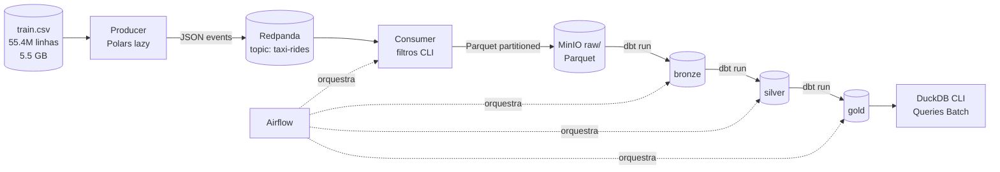

# Architecture

> Visão arquitetural detalhada. Para visão executiva, ver `README.md`.

## 1. Diagrama Macro



## 2. Componentes

### Producer
- Lê `train.csv` em modo lazy via Polars
- Valida cada linha com Pydantic
- Publica eventos JSON no tópico Kafka `taxi-rides`
- Particionamento Kafka: hash do `key`

### Redpanda
- Broker Kafka-compatible
- 1 partição (suficiente para o case)
- Retention default (24h)

### Consumer
- Subscribe no tópico `taxi-rides`
- Aplica filtros de data e local (zona ou bbox)
- Buffer interno, flush em batch
- Escreve Parquet particionado em MinIO/raw

### MinIO
- S3-compatible storage local
- Bucket `datalake` com 4 prefixos: `raw/`, `bronze/`, `silver/`, `gold/`
- Acessado via `pyarrow.fs.S3FileSystem` (consumer) e DuckDB `httpfs` (dbt)

### dbt + DuckDB
- DuckDB lê Parquet do MinIO via extensão `httpfs`
- Modelos materializados como `external` em Parquet (bronze, silver)
- Modelos `gold` materializados como `table` (volumes baixos)
- Lineage gerado automaticamente em docs

### Airflow
- LocalExecutor (sem necessidade de Celery)
- Metastore em Postgres
- 1 DAG: `taxi_pipeline`
- Tasks: `run_consumer`, `dbt_run/test_{bronze,silver,gold}`

## 3. Fluxo de Dados

### Streaming (real-time, via Kafka)
```
train.csv → producer → topic taxi-rides → consumer → s3://datalake/raw/
```

### Batch (após raw)
```
raw → bronze (tipagem + dedup)
bronze → silver (qualidade + enriquecimento)
silver → gold (agregações)
```

## 4. Camadas de Storage (Medallion)

| Camada | Path | Particionamento | Mutabilidade |
|--------|------|-----------------|--------------|
| `raw` | `s3://datalake/raw/` | `ingestion_date=YYYY-MM-DD` | append-only |
| `bronze` | `s3://datalake/bronze/taxi_rides/` | `pickup_year/pickup_month` | rebuild |
| `silver` | `s3://datalake/silver/taxi_rides/` | `pickup_year/pickup_month` | rebuild |
| `gold` | DuckDB tables | sem partição | rebuild |

## 5. Schemas (Resumo)

### Evento Kafka (raw)
```json
{
  "key": "string",
  "pickup_datetime": "ISO8601",
  "pickup_longitude": "float",
  "pickup_latitude": "float",
  "dropoff_longitude": "float",
  "dropoff_latitude": "float",
  "passenger_count": "int",
  "fare_amount": "float",
  "event_ts": "ISO8601"
}
```

### Silver (acrescenta)
```
+ pickup_year, pickup_month, pickup_day
+ pickup_hour, pickup_dow
+ trip_distance_km, trip_distance_manhattan_km
+ pickup_zone
```

### Gold (4 tabelas)
- `fares_by_hour` (24 linhas)
- `fares_by_zone` (6 linhas)
- `fares_by_day_zone` (cubo)
- `fares_hourly_heatmap` (dow × hour, 168 linhas)

## 6. Garantias

### Producer → Kafka
- At-most-once (sem retry no producer; mensagens descartadas em erro de validação)
- Schema validado antes do publish

### Kafka → Consumer
- At-least-once (offset commit manual após escrita Parquet)
- Idempotência via dedup no bronze (por `key`)

### Bronze → Silver → Gold
- Idempotente (full rebuild)
- Testes dbt em cada camada

## 7. Networking

Todos os serviços na rede default do Compose, comunicação por hostname:
- `redpanda:9092` (Kafka API interno)
- `localhost:19092` (Kafka API externo, para clientes host)
- `minio:9000` (S3 API)
- `postgres:5432`
- `airflow-webserver:8080` (mapeado para 8081 no host)

## 8. Limitações Conhecidas

- DuckDB single-node (não escala horizontalmente)
- Producer não é idempotente (restart reprocessa)
- Sem schema registry (Pydantic supre, mas não governa entre produtores/consumidores diferentes)
- LocalExecutor do Airflow (sem paralelismo distribuído)

## 9. Observabilidade

- Logs estruturados (JSON via structlog) em producer/consumer
- Redpanda Console (porta 8080) mostra tópicos, mensagens, consumer groups
- MinIO Console (porta 9001) mostra arquivos e métricas
- Airflow UI (porta 8081) mostra DAG runs e logs
- dbt docs serve (porta 8080 quando ativo) mostra lineage

## 10. Referências

- `docs/adr/*` — decisões justificadas
- `docs/data-profile.md` — perfil do dataset
- `specs/*` — specs de cada componente
